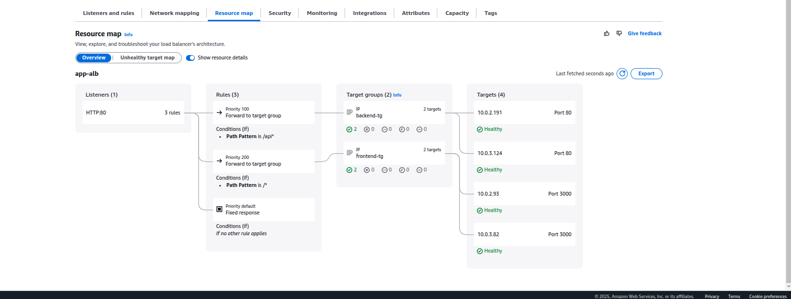

---

# AWS ECS Fargate Deployment with ALB, RDS Proxy, and Autoscaling

## Table of Contents
- [Overview](#overview)
- [Architectural Components](#architectural-components)
  - [Core Infrastructure](#core-infrastructure)
  - [Auto-Scaling](#auto-scaling)
- [Implementation Details](#implementation-details)
  - [Key Terraform Files](#key-terraform-files)
  - [Critical Dependencies](#critical-dependencies)
- [Deployment Steps](#deployment-steps)
  - [Prerequisites](#prerequisites)
  - [Execution](#execution)
- [Post-Deployment Verification](#post-deployment-verification)
- [Security Features](#security-features)
- [Maintenance & Troubleshooting](#maintenance--troubleshooting)
  - [Common Issues](#common-issues)

---

## Overview  
This project deploys a containerized 3 tier-application (frontend + backend+ database) on AWS ECS Fargate with an Application Load Balancer (ALB), MySQL RDS database, RDS Proxy, and auto-scaling capabilities. The infrastructure is fully defined using Terraform.


  
*(Resource mapping of ALB)*

---

## Architectural Components  
### Core Infrastructure  
1. **Networking**  
   - VPC with Public/Private Subnets across 2 AZs  
   - NAT Gateway for outbound private subnet traffic  
   - VPC Endpoints (Secrets Manager, ECR)  
   - Internet Gateway for public subnet  

2. **Load Balancing**  
   - Application Load Balancer (ALB) with:  
     - Path-based routing (`/*` → Frontend, `/api*` → Backend)  
     - Health checks from within ecs and target groups.
     - HTTP listener with 404 fallback  

3. **Compute**  
   - ECS Fargate Services:  
     - Frontend service (Port 3000)  
     - Backend service (Port 80)  
     - Database migration task (Run-once)  

4. **Database**  
   - MySQL RDS instance (Private subnet)  
   - RDS Proxy for connection pooling  
   - Automatic database migrations on deployment  

5. **Security**  
   - Security Groups with least-privilege rules  
   - Secrets Manager for credentials storage  
   - IAM roles with granular permissions  

6. **Observability**  
   - CloudWatch Log Groups per service  
   - Container Insights enabled  
   - Application logs retention (7 days default)  

### Auto-Scaling  
| Service    | Metric                | Scale-Out | Scale-In | Capacity     |  
|------------|-----------------------|-----------|----------|--------------|  
| Frontend   | 500 reqs/target       | 60s       | 180s     | 2-10 tasks   |  
| Backend    | 60% CPU Utilization   | 120s      | 300s     | 2-6 tasks    |  

---


## Implementation Details

### Key Terraform Files
```
├── alb.tf               # Load Balancer config
├── auto_scaling.tf      # Auto-scaling policies
├── backend_ecs.tf       # Backend service definition
├── db_migration.tf      # Database migration task
├── ecs.tf               # ECS cluster config
├── frontend_ecs.tf      # Frontend service definition
├── iam.tf               # IAM roles/policies
├── logging.tf           # CloudWatch log groups
├── network.tf           # VPC/Subnets/Routing
├── rds.tf               # RDS & Proxy config
├── secrets.tf           # Secrets Manager setup
├── security_groups.tf   # Security Group rules
└── variables.tf         # Configuration variables
```

### Critical Dependencies
1. **Container Images**
   - Frontend: `lamp-frontend:latest`
   - Backend: `lamp-backend:latest`
 

2. **Secrets Management**
   - Database credentials stored in Secrets Manager
   - JWT secret auto-generated
   - Frontend URL dynamically injected

3. **Database Migrations**
   - Runs SQL files from `/var/www/html/migrations`
   - Executed before backend service deployment
   - One-time task with CloudWatch logging

## Deployment Steps

### Prerequisites
1. Terraform v1.0+ installed
2. AWS CLI configured with credentials
3. Docker images pushed to ECR
4. Required IAM permissions
5. Ensure execute permissions:
```bash
chmod +x deploy.sh
### Execution
```bash
# Run deployment script
./deploy.sh
```


**deploy.sh** contents:
```bash
#!/bin/bash
set -eo pipefail

# Initialize
TERRAFORM_DIR=$(pwd)
STAGE_PREFIX="[DEPLOYMENT]"
BACKEND_HEALTH_ENDPOINT="/api/v1/health"

function format_terraform() {
  echo "$STAGE_PREFIX Formatting Terraform files..."
  terraform fmt
}

function plan_terraform() {
  echo "$STAGE_PREFIX These are the changes that will be applied to your infrastructure..."
  terraform plan
}
function validate_terraform() {
  echo "$STAGE_PREFIX Validating Terraform configuration..."
  terraform validate
}

function apply_infrastructure() {
  echo "$STAGE_PREFIX Applying infrastructure..."
  terraform apply -auto-approve
}


function verify_frontend() {
  local alb_dns=$(terraform output -raw alb_dns_name)
  local =$(terraform output -raw alb_url)
  
  echo "$STAGE_PREFIX Verifying frontend at http://$alb_dns..."
  echo "$STAGE_PREFIX Verifying frontend url [ http://$alb_dns_url ]..."
  
  for i in {1..5}; do
    if curl -s "http://$alb_dns" | grep -q "<title>"; then
      echo "$STAGE_PREFIX Frontend is healthy!"
      return 0
    fi
    sleep 5
  done
  
  echo "$STAGE_PREFIX Frontend verification failed"
  return 1
}


# Main Deployment Flow

format_terraform

plan_terraform

validate_terraform

# Phase 1: Apply All Infrastructure
apply_infrastructure


# Phase 2: Frontend Services Verification
verify_frontend || exit 1

# Final Apply to Ensure Everything is Synced
echo "$STAGE_PREFIX Running final Terraform apply..."
terraform apply -auto-approve

echo "$STAGE_PREFIX Deployment completed successfully!"


```

### Expected Outputs
```text
[DEPLOYMENT] Formatting Terraform files...
Terraform fmt completed

[DEPLOYMENT] Validating Terraform configuration...
Success! The configuration is valid.

[DEPLOYMENT] Applying infrastructure...
aws_vpc.main: Creating...
aws_subnet.public[0]: Creating...
aws_subnet.public[1]: Creating...
...
Apply complete! Resources: 23 added, 0 changed, 0 destroyed.

[DEPLOYMENT] Verifying backend at app-alb-123456789.eu-west-1.elb.amazonaws.com/api/v1/health...
[Attempt 1/10] Received HTTP 503 - Retrying in 10s
[Attempt 2/10] Received HTTP 200
[DEPLOYMENT] Backend is healthy!

[DEPLOYMENT] Verifying frontend at http://app-alb-123456789.eu-west-1.elb.amazonaws.com...
[Attempt 1/5] Found HTML content
[DEPLOYMENT] Frontend is healthy!

[DEPLOYMENT] Running final Terraform apply...
No changes. Infrastructure is up-to-date.

[DEPLOYMENT] Deployment completed successfully!

Outputs:
frontend_url = "http://app-alb-123456789.eu-west-1.elb.amazonaws.com"
backend_health = "http://app-alb-123456789.eu-west-1.elb.amazonaws.com/api/v1/health"
```

## Post-Deployment Verification

1. **Application Access**
   ```bash
   curl $(terraform output -raw frontend_url)
   #frontend_url in output.tf
   ```

2. **Health Checks**
   ```bash
   curl $(terraform output -raw backend_health) #backend_health in output.tf
   ```

3. **Log Inspection**
   ```bash
   aws logs tail /ecs/prod/backend --follow
   aws logs tail /ecs/prod/frontend --follow
   ```

4. **Scaling Verification**
   ```bash
   aws application-autoscaling describe-scaling-activities \
     --service-namespace ecs
   ```

## Security Features

1. **Network Security**
   - ALB only exposes port 80
   - RDS only accessible via RDS Proxy
   - Private subnets for database and ECS tasks

2. **Secrets Protection**
   - Database credentials never in plaintext
   - Automatic password rotation capability
   - Secrets encrypted via AWS KMS

3. **IAM Least Privilege**
   - ECS tasks only get necessary permissions
   - RDS Proxy has minimal Secrets Manager access
   - No persistent SSH access to containers

## Maintenance & Troubleshooting

### Common Issues
**Database Connection Failures**
1. Verify RDS Proxy status
2. Check security group rules (SG → RDS Proxy)
3. Review migration task logs

**Service Unhealthy**
1. Check ALB target group health checks
2. Review ECS task health checks
3. Inspect container logs in CloudWatch

